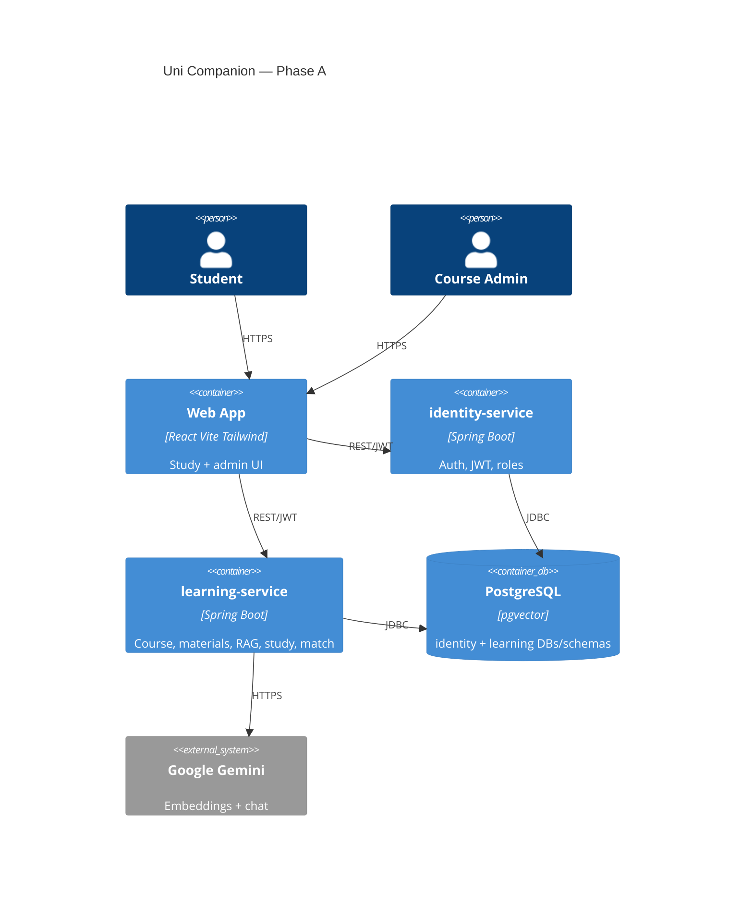
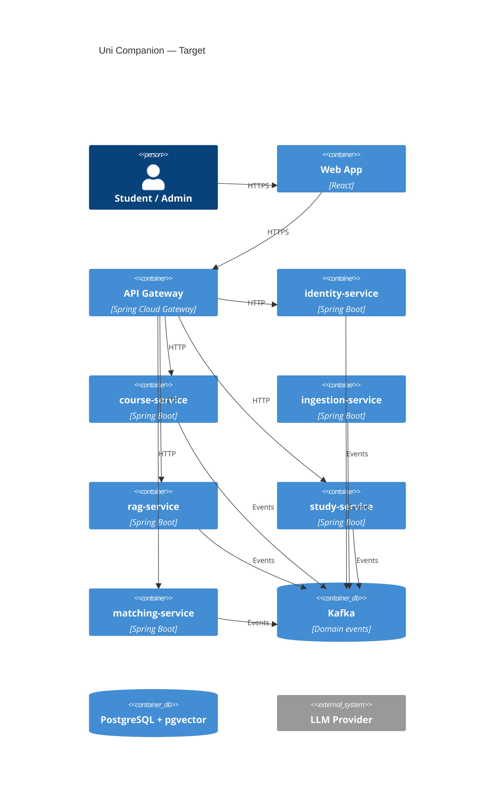

# System Architecture

| Field | Value |
|---|---|
| Document ID | DOC-ARCH |
| Version | 0.1.0 |
| Status | Draft |
| Last updated | 2026-09-27 |
| Owner | Tech lead |

## 1. Purpose

Describe Phase A and target architecture for Uni Companion.

## 2. Architectural principles

| ID | Principle |
|---|---|
| P-1 | Canonical materials are admin-owned; students consume |
| P-2 | Study access requires enrollment ∧ READY ∧ PUBLISHED |
| P-3 | Database/schema per deployable service |
| P-4 | Sync HTTP for interactive UX; async for ingestion |
| P-5 | Progressive decomposition (Phase A modular monolith-ish learning service) |
| P-6 | Provider interfaces for LLM/embeddings (Gemini now) |
| P-7 | Privacy by default for matching and materials |

## 3. Phase A container view



## 4. Target container view



## 5. Phase A vs target mapping

| Target service | Phase A home |
|---|---|
| api-gateway | Deferred — direct service URLs |
| identity-service | `identity-service` |
| course + ingestion + rag + study + matching | packages inside `learning-service` |
| notification-service | Deferred |
| Kafka | Deferred — job/status table |

## 6. Key runtime flows (Phase A)

### Material lifecycle

```text
Admin upload → UNPUBLISHED + PROCESSING
     → PDFBox extract → chunk → Gemini embed → pgvector
     → READY | FAILED
Admin publish → PUBLISHED
Student (enrolled) may study iff READY ∧ PUBLISHED
Admin unpublish → hidden from students + excluded from retrieval
```

### RAG query

```text
Student question
 → authorize enrollment
 → retrieve top-k chunks (published+ready only)
 → Gemini chat with excerpts
 → answer + citations
```

## 7. Quality tactics

| Attribute | Tactic |
|---|---|
| Security | JWT, role checks, enrollment checks, unpublished exclusion |
| Reliability | Ingest status + admin retry |
| Operability | Actuator health; correlation IDs in logs |
| Evolveability | Modular packages; LLM interfaces; ADR trail |
| Cost | Gemini free tier; cache embeddings; rate-limit generation |
| Verifiability | TDD for domain/API rules; fakes for Gemini ([TESTING.md](TESTING.md)) |

## 8. Decisions

| Topic | ADR |
|---|---|
| Microservices target | [ADR-0001](adr/0001-microservices-architecture.md) |
| Kafka deferred then adopted | [ADR-0002](adr/0002-kafka-progressive-adoption.md) |
| React Vite SPA | [ADR-0003](adr/0003-react-vite-frontend.md) |
| Progressive decomposition | [ADR-0004](adr/0004-progressive-decomposition.md) |
| Gemini provider | [ADR-0005](adr/0005-gemini-llm-provider.md) |
| TDD approach | [ADR-0006](adr/0006-tdd-approach.md) |

## 9. References

- [Services](SERVICES.md)
- [Backend](BACKEND.md)
- [Frontend](FRONTEND.md)
- [Messaging](MESSAGING.md)
- [Testing](TESTING.md)
- [Execution Plan](EXECUTION-PLAN.md)
- [Security](SECURITY.md)
